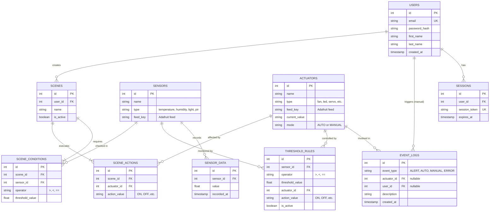

# Database diagram.

### 1. Identity
*Handles User Registration and Login.*

**`Users`**
* `id` (Primary Key)
* `email` (String, Unique) - For login and password recovery.
* `password_hash` (String)
* `full_name` (String)

---

### 2. Hardware Management
*Separates input devices from output devices for easier automation logic.*

**`Sensors`** (Inputs)
* `id` (Primary Key)
* `name` (String) - *e.g., "Nhiệt độ phòng khách"*
* `adafruit_feed` (String) - *The exact topic name to subscribe to on Adafruit IO.*

**`Actuators`** (Outputs)
* `id` (Primary Key)
* `name` (String) - *e.g., "Quạt máy"*
* `adafruit_feed` (String)
* `status` (String) - *e.g., "ON", "OFF", "90"*
* `is_auto_mode` (Boolean) - *If `true`, the system follows threshold rules. If `false`, the user has manually overridden it.*

---

### 3. Data & Logging
*Handles real-time metric storage and the system's activity history.*

**`Sensor_Data`** (For drawing charts)
* `id` (Primary Key)
* `sensor_id` (Foreign Key -> Sensors.id)
* `value` (Float) - *The reading from Adafruit.*
* `created_at` (Timestamp)

**`Activity_Logs`** (The system's audit trail)
* `id` (Primary Key)
* `device_name` (String) - *Stored as text so the log remains even if a device is deleted later.*
* `event_type` (String) - *"AUTO", "MANUAL", "ALERT", or "ERROR".*
* `description` (String) - *e.g., "User turned Fan ON" or "Temp > 30°C: Fan auto-started".*
* `created_at` (Timestamp)

---

### 4. Automation Engine
*Handles the environmental threshold configurations.*

**`Rules`** (The "If this, then that" logic)
* `id` (Primary Key)
* `sensor_id` (Foreign Key -> Sensors.id)
* `condition` (String) - *">", "<", or "==".*
* `threshold_value` (Float) - *e.g., 30.5*
* `actuator_id` (Foreign Key -> Actuators.id)
* `action_command` (String) - *What to send to Adafruit (e.g., "ON").*
* `is_active` (Boolean) - *Allows the user to temporarily pause a specific rule.*